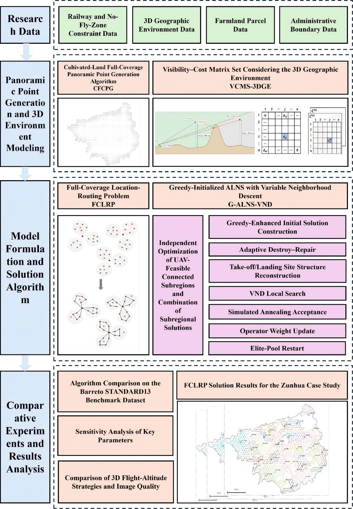
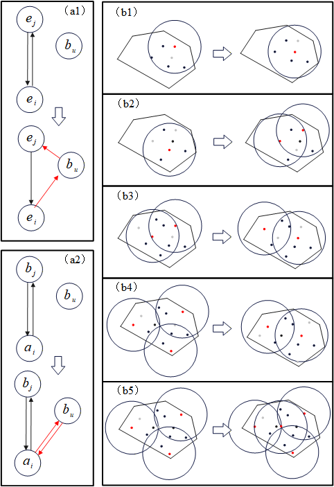
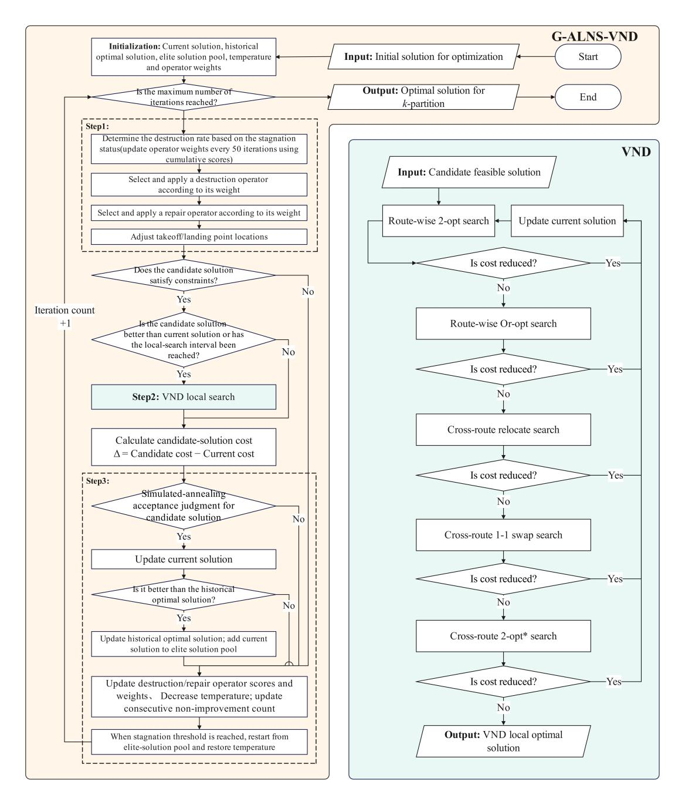
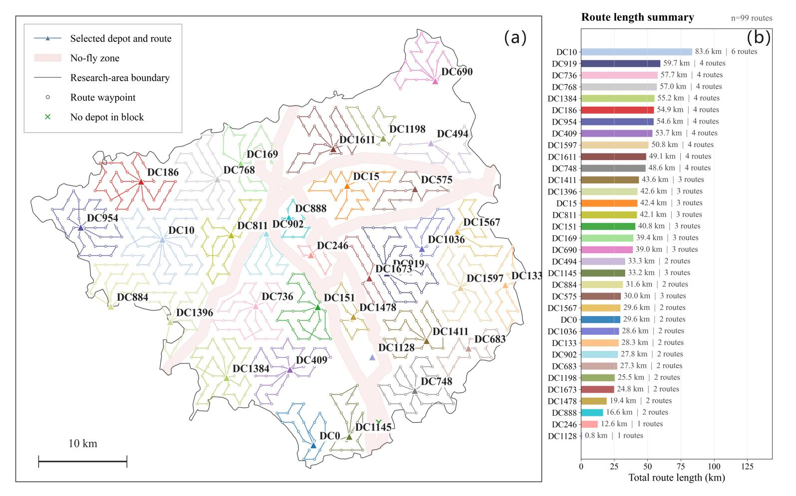
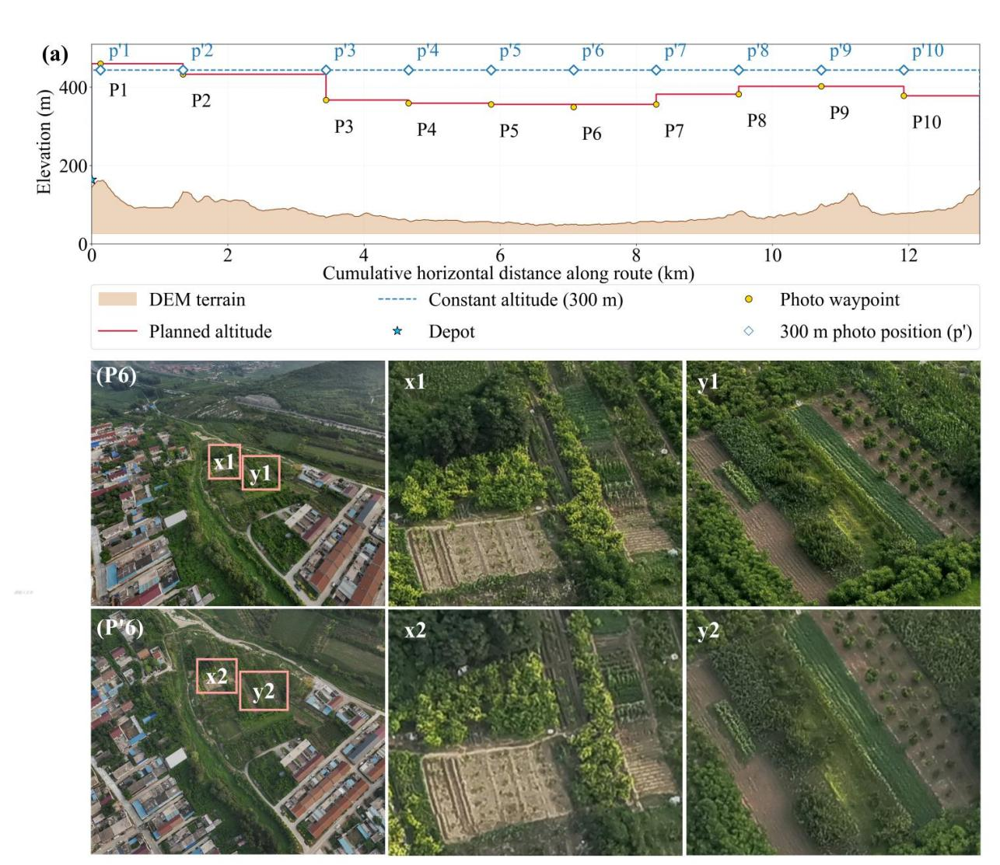

# Full-Coverage Location-Routing Planning for Farmland under Controlled Complex 3D Geographic Environments: A Case Study of Zunhua, China

This repository contains the Zunhua case-study implementation for the manuscript *Full-Coverage Location-Routing Planning for Farmland under Controlled Complex 3D Geographic Environments: A Case Study of Zunhua, China*.

The code treats large-area UAV farmland monitoring as a coupled location-routing problem. It jointly selects take-off/landing sites, assigns panoramic acquisition points, constructs closed UAV routes, and evaluates terrain-aware flight cost while enforcing line-of-sight, route-length, capacity, and no-fly-zone constraints.



## What is implemented

The workflow in [02_solve_zunhua_CLRP_ALNS.py](02_solve_zunhua_CLRP_ALNS.py) follows four methodological components from the manuscript:

- **CFCPG** generates discrete panoramic acquisition points from farmland coverage circles, removes points in no-fly areas, retains farmland-related points, and partitions the study area into UAV-feasible connected subregions.
- **VCMS-3DGE** builds DEM-based line-of-sight relationships, safe horizontal navigation distances, and directed ascent, horizontal-flight, and descent distances.
- **FCLRP** minimizes take-off/landing-site construction cost, route activation cost, and 3D flight-distance cost.
- **G-ALNS-VND** combines greedy initialization, adaptive destroy-repair search, take-off/landing-site restructuring, VND route improvement, simulated-annealing acceptance, adaptive operator weights, and elite-pool restart.

Each connected subregion is solved independently. The script then combines the subregional solutions into a study-area plan.

## Algorithm overview

The initial solution first selects a high-coverage set of candidate sites, inserts panoramic points into feasible existing or single-point routes, and then applies five local site-route restructuring patterns. These patterns include relocation, local merging, and controlled expansion of the selected site structure.



Starting from this strengthened solution, each G-ALNS-VND iteration performs adaptive destroy-repair search and candidate site restructuring. Feasible candidates are intensified with five VND neighborhoods: intra-route 2-opt, intra-route Or-opt, inter-route relocate, inter-route 1-1 swap, and inter-route 2-opt*. Non-improving solutions may be accepted by the simulated-annealing rule, and an elite solution is used to restart the search after stagnation.



## Zunhua case study

The case study uses real geospatial data for Zunhua, Hebei, including:

- the Zunhua administrative boundary;
- railway data used to construct no-fly constraints;
- a DEM for terrain elevation and line-of-sight checks;
- farmland polygons used to generate monitoring targets;
- a discrete candidate set of take-off/landing sites.

The candidate sites are planning-level candidates generated as a relatively uniform set. They should not be interpreted as final engineering sites because road access, land ownership, power supply, communication infrastructure, construction conditions, and site safety are not modeled.

Under the manuscript baseline, the study area contains 153 farmland patches covering 629.13 km². The representative plan opens 34 take-off/landing sites and produces 99 closed UAV routes, covering 138 patches and 540.66 km², with an overall coverage rate of 85.94%.



The manuscript reports a five-run mean total cost of CNY 3,026,568.06, with CNY 1,710,000.00 in site construction cost and CNY 1,316,568.06 in flight cost. The representative run with seed 11 opens 34 sites and produces 99 routes.

## 3D flight representation

For each feasible route segment, the implementation separates:

1. ascent from the origin node to the safe cruising elevation;
2. horizontal travel along a direct or no-fly-zone-detour trajectory;
3. descent to the destination node.

The resulting directed 3D distance is used consistently in the objective, insertion costs, VND moves, route-length checks, and final route exports. A terrain-clearance margin is applied to DEM profiles. Railway exclusion areas are handled by safe detours rather than by allowing direct segments through the restricted geometry.



The manuscript compares a terrain-following strategy at approximately 120 m above local ground level with a fixed 300 m altitude relative to the take-off site. For exact reproduction of the current script, use the constants in the file: the current implementation sets `CLRP_DEPOT_HEIGHT_AGL = 20.0`, `CLRP_WAYPOINT_HEIGHT_AGL = 300.0`, and `CLRP_DEM_CLEARANCE = 20.0`. These code defaults should be treated as authoritative when reproducing the current repository state.

## Repository layout

```text
.
├── 02_solve_zunhua_CLRP_ALNS.py      # Main data preparation, solver, experiment, and plotting script
├── lib_no_fly_zone_detour.py         # No-fly-zone detour and safe navigation geometry
├── lib_zunhua_experiment_common.py   # Shared configuration and multiprocessing helpers
├── figures/                          # Manuscript-aligned illustrations and case-study figures
└── LICENSE
```

The current repository does not include the Zunhua GIS data directory or Barreto benchmark files. They must be supplied separately before the full case-study run can start.

## Data directory expected by the script

The main script searches for `FCLRP_Zunhua_data` next to the repository directory (`_REPO_ROOT` in the script), with the following files:

```text
FCLRP_Zunhua_data/
├── zunhua_random_depots_2000/     # One or more candidate-site Shapefiles
├── zunhua_admin_boundary/
│   ├── zunhua.shp                 # WGS84 source boundary
│   └── zunhua_UTM50N.shp          # Meter-based working boundary, generated if absent
├── hebei_railway/
│   └── hebei_railway.shp
├── zunhua_farmland/
│   └── 2020_class_11_12.shp
└── zunhua_DEM/
    └── Zunhua_DEM_12.5_wgs84_study_area_interpolated.tif
```

All Shapefile sidecar files (`.shx`, `.dbf`, `.prj`, and any other required sidecars) must be present. The working boundary must use a meter-based projected CRS; if `zunhua_UTM50N.shp` and its projection file are absent, the script attempts to create them from `zunhua.shp` using EPSG:32650.

## Installation

Use Python 3.10 or newer and install the scientific, geospatial, and plotting dependencies:

```bash
python -m pip install numpy rasterio matplotlib shapely pyshp pyproj geopandas python-docx
```

`geopandas` is only needed when the projected administrative boundary has to be generated. On Windows, run the script from the repository root so multiprocessing can resolve both helper modules and the data paths correctly.

## Run the Zunhua experiment

After placing the required data directory in the expected location, run:

```bash
python 02_solve_zunhua_CLRP_ALNS.py
```

The default configuration in the script uses:

| Setting | Default |
|---|---:|
| No-fly-zone constraint | enabled |
| Site construction cost | CNY 50,000 per site |
| Maximum line-of-sight distance | 6,000 m |
| Single-UAV service radius | 10,000 m |
| Maximum route length | 20,000 m |
| ALNS iteration budget | 1,000 |
| Random seeds | 11, 23, 37, 72, 211 |
| Maximum worker processes | 8, capped by CPU count and task count |
| Matrix/checkpoint reuse | enabled |

The script loads and prepares the spatial data once, creates safe navigation and 3D distance matrices, solves every UAV-feasible block for every seed, and combines the results. The full run can be computationally intensive because DEM profiling, no-fly-zone detours, and multiple independent metaheuristic searches are all included.

For a quick smoke test, temporarily reduce `CLRP_PARALLEL_RANDOM_SEEDS`, `CLRP_MAX_ITER`, and `CLRP_PARALLEL_MAX_WORKERS` near the top of the script. Restore the manuscript settings for an experimental reproduction.

## Outputs

Results are written under the script directory:

```text
outputs/CLRP_zunhua/
└── with_no_fly_zone_iter_1000/
    ├── zunhua_experiment_summary_with_no_fly_zone.csv
    ├── zunhua_block_summary_with_no_fly_zone.csv
    ├── zunhua_all_iterations_with_no_fly_zone.csv
    ├── zunhua_experiment_statistics_with_no_fly_zone.csv
    └── seed_11/
        ├── zunhua_solution_result_with_no_fly_zone_seed_11.json
        ├── zunhua_solution_with_no_fly_zone_seed_11.png
        ├── zunhua_route_3d_segments_with_no_fly_zone_seed_11.csv
        └── ...
```

Depending on the scenario and configuration, the run also exports candidate-site, visibility, flight-matrix, node-elevation, unreachable-waypoint, iteration-history, route-geometry, map, legend, and route-length files. Matrix and navigation checkpoints are stored under `checkpoints/` and can be reused by later runs when their configuration and source-data signatures match.

To redraw a saved result without rerunning the optimizer, set `CLRP_REPLOT_RESULT_JSON` in the script to the path of a saved solution JSON and run the script again.

## Model constraints

The solver treats the following as hard constraints:

- every valid panoramic acquisition point is served exactly once;
- every non-empty route starts and ends at its assigned take-off/landing site;
- route capacity and the maximum number of routes per site are respected;
- every route satisfies the maximum 3D route-length limit;
- site-to-panorama line of sight is satisfied;
- every consecutive route segment has a finite safe horizontal trajectory;
- no route crosses a railway-derived no-fly exclusion zone.

The objective is the sum of site construction cost, route fixed cost, and directed 3D flight-distance cost. The code does not explicitly model wind, battery state of charge, payload, flight speed, or different energy-consumption rates for ascent, cruise, and descent.

## Results reported in the manuscript

The manuscript also evaluates the algorithm on the 13 Barreto STANDARD13 capacitated location-routing instances. G-ALNS-VND obtains a mean gap of 3.76%, compared with 5.11% for standard ALNS, and achieves the best mean gap on five instances. Those benchmark inputs and comparison implementations are not included in this repository; the main executable here is the real-data Zunhua case-study pipeline.

The manuscript's sensitivity analysis varies site construction cost, maximum line-of-sight distance, single-UAV service radius, and ALNS iteration budget. Within the tested ranges, maximum line-of-sight distance has the strongest effect on the number of open sites and total cost, while 1,000 iterations provides a practical balance between solution quality and runtime.

## Citation

If you use this implementation, the figures, or the associated methodology, please cite:

> Xinxin Zhou, Runtian Wang, Yulin Xiao, Yuanpei Gou, Lin Li, Siyu Zhu, Yong Wang, and Linwang Yuan. *Full-Coverage Location-Routing Planning for Farmland under Controlled Complex 3D Geographic Environments: A Case Study of Zunhua, China.* Manuscript.

Please replace the manuscript placeholder with the final publication details and DOI when available.

## License

See [LICENSE](LICENSE).
